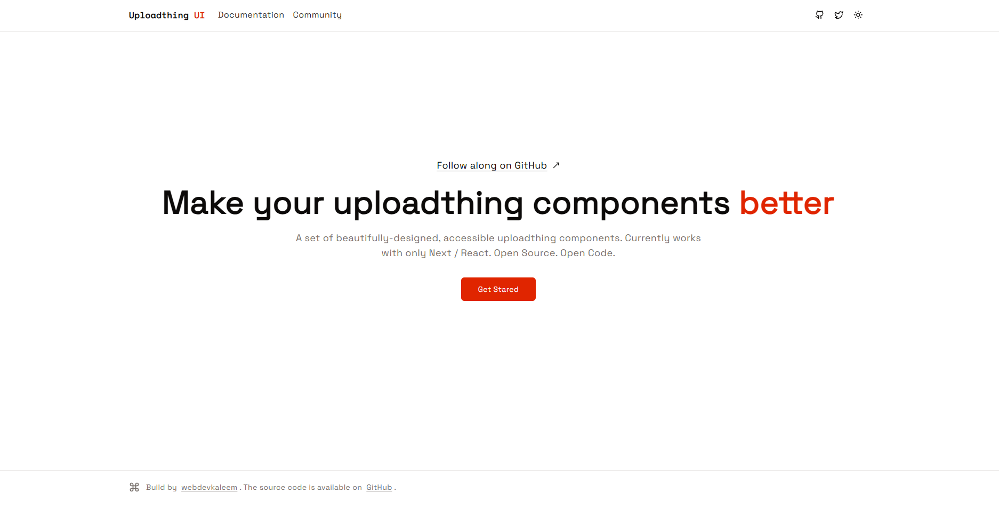

# Uploadthing UI

Custom UI components for Uploadthing built on top of the [Shadcn Registry](https://ui.shadcn.com/docs/registry). This project is for [Next JS](https://nextjs.org/)/[React](https://react.dev/) only. It's an opinionated way of handling uploadthing's client side state.



| Documentation: https://docs-uploadthing-ui.vercel.app

| Registry: https://uploadthing-ui.vercel.app

## Installation of the Registry

**Clone the repository:**
```bash
git clone https://github.com/webdevkaleem/uploadthing-ui.git
```
**Create a .env file in the root directory and add the following variables**
```bash
UPLOADTHING_TOKEN=""
```
**Install dependencies**
```bash
pnpm install
```
**Start the development server**
```bash
pnpm run dev
```

<br/>

## Roadmap
- Expand component functionalities
- Enhance documentation and examples
- Integrate additional features and improvements

<br/>

## Shadcn Registry
Visit the [shadcn documentation](https://ui.shadcn.com/docs/registry) to view the full documentation.

<br/>

## Contributing
Contributions are welcome! Please open an issue or submit a PR to help improve the project.

<br/>

### License
[MIT](https://choosealicense.com/licenses/mit/)
